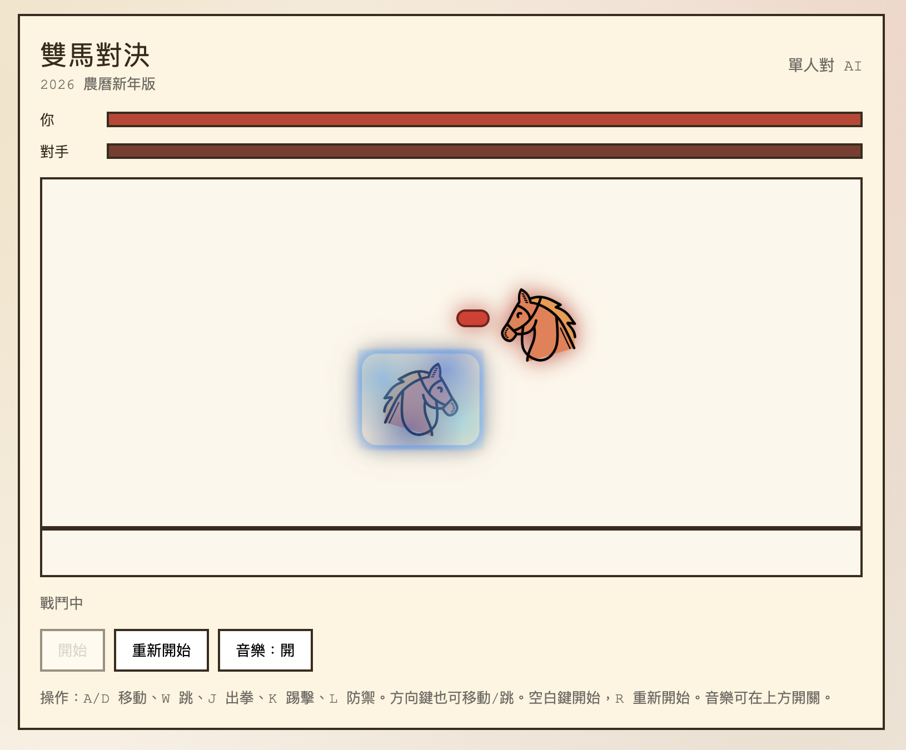

# 雙馬對決 - 2026 新年快樂

單人對 AI 的雙馬對戰小遊戲，靈感來自經典街機對戰。
此專案使用 Codex（**GPT-5.2-Codex**）完成。



## 特色
- 單人對 AI
- 出拳 / 踢擊 / 防禦 / 跳躍 / 移動
- 農曆新年視覺風格與背景音樂
- 鍵盤與手機觸控操作

## 操作方式
- 移動：`A` / `D`（或方向鍵 左/右）
- 跳躍：`W`（或方向鍵 上）
- 出拳：`J`
- 踢擊：`K`
- 防禦：`L`
- 開始：`空白鍵`
- 重新開始：`R`

## 本機啟動
```bash
npm install
npm run dev
```
啟動後依照 Vite 輸出的本機網址開啟（通常是 `http://localhost:5173`）。

## 建置
```bash
npm run build
npm run preview
```

## 素材
- 馬圖：`/Users/charleswang/GitHub/codex-test/src/assets/horse.png`
- 音樂：`/Users/charleswang/GitHub/codex-test/src/assets/lunar.mp3`

## 部署（Vercel）
1. 將專案推送到 GitHub。
2. 在 Vercel 建立新專案並匯入此 repo。
3. 使用預設 Vite 設定部署。

## 手動檢查
- 開始、移動、跳躍、出拳、踢擊、防禦。
- AI 會回應並造成傷害。
- 重新開始會重置戰局。
- 音樂可開關並循環播放。
